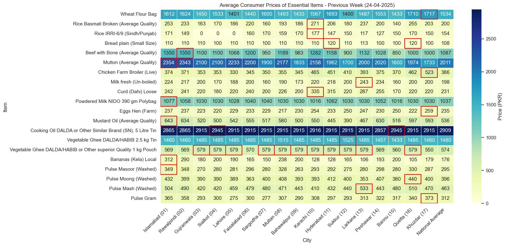
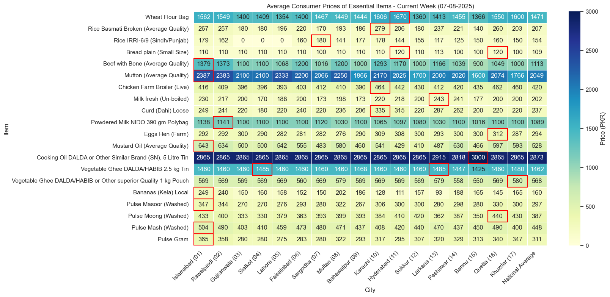
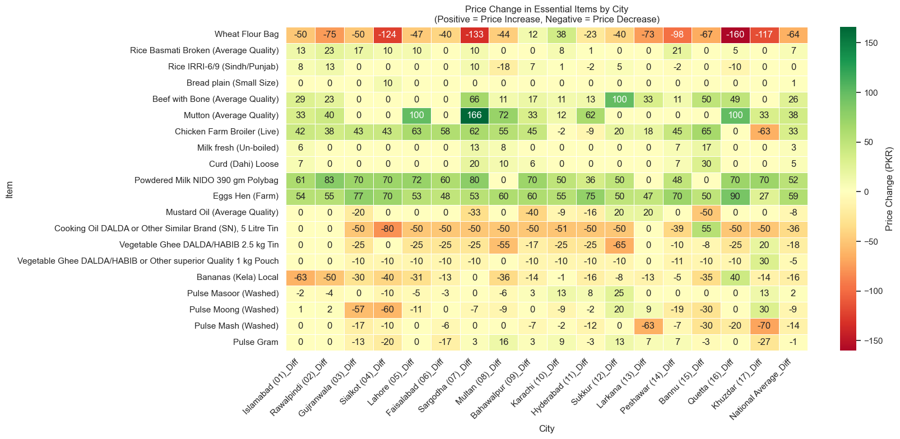
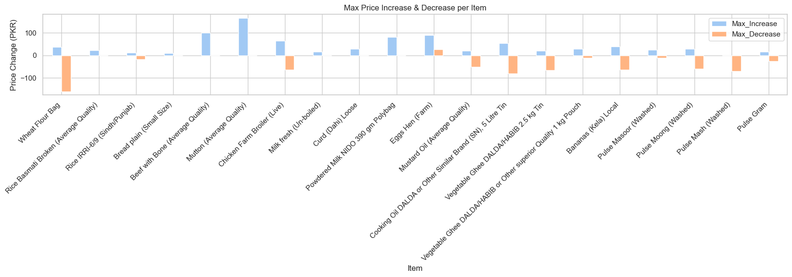

# Weekly Consumer Prices Analysis - Pakistan

This project analyzes the **average consumer prices of essential items** across major Pakistani cities, using weekly data published by the Pakistan Bureau of Statistics (PBS). The goal is to visualize **price changes week-on-week** and highlight trends in essential items.

---

## Dataset

Two Excel files are used in this analysis:  

- `Annex_07.08.2025.xlsx` – Prices for the week ending **07-08-2025**  
- `SPI-Annex_24.04.2025.xlsx` – Prices for the week ending **24-04-2025**  

Each file contains average prices of essential items across various cities.

---

## Project Structure

- `Consumer_Prices_Analysis.ipynb` – Jupyter Notebook containing:
  1. Data cleaning and preparation
  2. Heatmap of previous week's prices
  3. Heatmap of current week's prices
  4. Week-on-week comparison heatmap
  5. Bar-plot showing max price increases and decreases per item

- `data/` – Folder containing the Excel files  
- `images/` – Folder containing visualizations:
  - `previous_week.png`  
  - `current_week.png`  
  - `price_changes.png`  
  - `highlight.png`  

---

## Libraries Used

- **pandas** – For data cleaning, manipulation, and combining multiple sheets  
- **matplotlib** – For creating plots and heatmaps  
- **seaborn** – For enhanced visualization and color-coded heatmaps  

---

## Features

1. **Heatmap of Previous Week** – Shows average prices of essential items with highest prices highlighted.  
   

2. **Heatmap of Current Week** – Same as above but for the latest week.  
   

3. **Week-on-Week Comparison** – Highlights **price increases** (green) and **decreases** (red) for easy insight.  
   

4. **Bar Plot of Max-Min Prices** – Shows the max price increases and decreases per item.  
   

---

## How to Run

1. Clone the repository:  
```bash
git clone https://github.com/faraz-abbasi/Consumer_Prices_Analysis.git
```
2. Open the Jupyter Notebook (Consumer_Prices_Analysis.ipynb) in Jupyter Lab or VS Code.
3. Install the required Python libraries (if not already installed):
```bash
pip install pandas matplotlib seaborn openpyxl
```
4. Update the Excel file paths in the notebook if necessary.
5. Run the notebook cell by cell to view the visualizations and insights.

